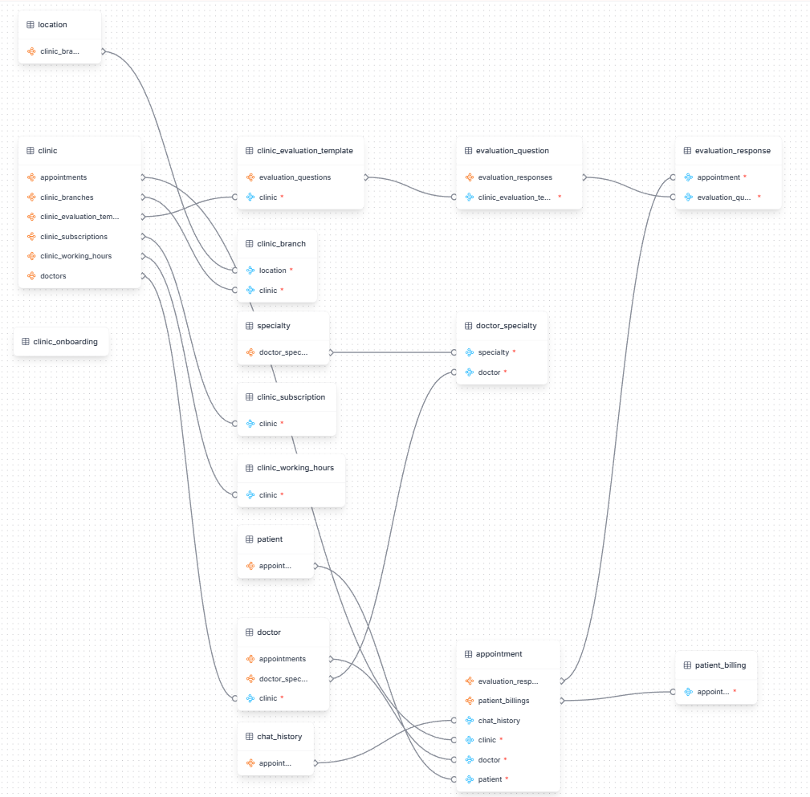

# Documentación de Arquitectura y Estrategia - OCAI Medical

## 1. Estrategia General

Este desarrollo implementa una arquitectura híbrida y modular dividida en dos grandes flujos:

1.  **Operación Clínica (Citas/Pacientes):** Enfocada en la atomicidad y velocidad transaccional para el Agente de IA.
2.  **Gestión Administrativa (Onboarding B2B):** Enfocada en la integridad referencial masiva y la facilidad de uso para el equipo de operaciones.

Ambos flujos convergen en una única base de datos PostgreSQL en Google Cloud, garantizando una "Fuente Única de Verdad".

---

## 2. Diagrama de Entidad-Relación (ERD)

El siguiente esquema muestra la estructura relacional de la base de datos `medical`.

*Nota: La tabla `clinic_onboarding` aparece desconectada intencionalmente en el diagrama, ya que funciona como tabla de paso (staging) antes de poblar las tablas relacionales mediante procedimientos almacenados.*

---

## 3. Arquitectura Técnica

### A. Backend Operativo (Citas & Pacientes)
* **Tecnología:** Cloud Function (Python + Flask) + `pg8000`.
* **Función:** Procesa solicitudes en tiempo real del Agente de IA.
* **Lógica:**
    * Valida y sanitiza entradas (nombres, teléfonos).
    * Ejecuta la función orquestadora `mvp_create_patient_appointment_evaluation`.
    * Realiza operaciones idempotentes (UPSERT) para evitar duplicados.

### B. Backend Administrativo (Onboarding Clínicas)
* **Interfaz (UI):** NocoDB (alojado en AWS EC2).
* **Middleware:** n8n (Orquestación de flujos).
* **Base de Datos:** PostgreSQL (Google Cloud SQL).
* **Estrategia "Staging Table":**
    * Se utiliza una tabla plana `clinic_onboarding` para la entrada de datos.
    * Soporta estructuras anidadas (JSONB) para cargar listas de doctores en un solo registro.
    * Un Procedimiento Almacenado (`process_clinic_onboarding`) transforma y distribuye estos datos a las tablas relacionales (`clinic`, `branch`, `doctor`, `specialty`, etc.) en una sola transacción atómica.

---

## 4. Flujos de Datos Detallados

### Flujo 1: Creación de Citas (MVP)
1.  **Validación:** Datos mínimos requeridos se validan y sanitizan en Python.
2.  **Conexión:** Se establece conexión segura a PostgreSQL.
3.  **Transacción Unificada (PL/pgSQL)**:
    * `upsert_patient`: Crea o actualiza paciente.
    * `chat_history`: Registra la traza de la conversación.
    * `upsert_appointment`: Agenda la cita validando disponibilidad.
    * `upsert_evaluation_response`: Guarda respuestas de triaje.
4.  **Respuesta:** Retorna JSON con IDs generados.

### Flujo 2: Onboarding de Clínicas (B2B)
1.  **Entrada:** El equipo de operaciones llena **una sola fila** en NocoDB (Tabla `clinic_onboarding`).
    * Incluye datos de la clínica, sede, suscripción y un JSON con el staff médico.
2.  **Disparador:** n8n detecta el nuevo registro.
3.  **Procesamiento (ETL en Database):**
    * n8n invoca al SP `process_clinic_onboarding`.
    * El SP crea la **Clínica** -> **Ubicación** -> **Sede** -> **Suscripción**.
    * Genera horarios por defecto.
    * Itera sobre el JSON de doctores para crear **Especialidades** (si no existen) y **Doctores**, vinculándolos automáticamente.
4.  **Resultado:** El estado en NocoDB cambia a "Completed" o "Error" (con detalle del fallo).

---

## 5. Observabilidad y Seguridad

* **Integridad de Datos:** Uso estricto de `FOREIGN KEYS`, `CHECK constraints` y transacciones ACID.
* **Seguridad de Red:** Conexiones restringidas por IP (AWS <-> GCP) y uso de SSL.
* **Logging:** Identificadores únicos (`request_id`) y registro de errores detallado en tablas de sistema.

### Ventajas de esta Arquitectura
* **Desacoplamiento:** El Agente de IA no se ve afectado por tareas administrativas.
* **Escalabilidad:** El modelo de datos soporta múltiples sedes y doctores por clínica desde el diseño.
* **Resiliencia:** Si falla un paso en el onboarding, se hace rollback total, evitando datos "huérfanos".